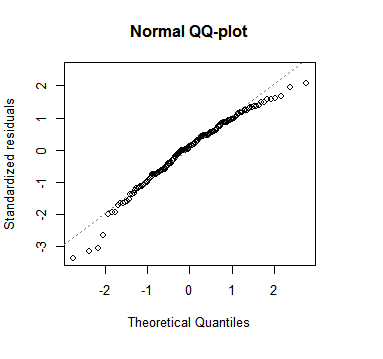

# Regression and model validation

####Reading the data to students2014
  students2014 <- read.csv("learning2014.csv")

####Getting a simple overview of the data
  head(students2014)
  str(students2014)
  
#### There is 7 varriables and 166 observations.
##### The variables are:

הההההההה

  1. (*gender*) Gender, male (M) or female (F). 
  2. (*age*) Age, in years. 
  3. (*attitude*) Attitude towards statistics. 
  4. (*deep*) Deep learning, measured by avergagen serie of questions.
  5. (*stra*) Strategic learning, measured by averagagen serie of questions.
  6. (*surf*) Surface learning, measured by averagagen serie of questions. 
  7. (*points*) Exam points.
  
You can get more info of the questions asked in <http://www.helsinki.fi/~kvehkala/JYTmooc/JYTOPKYS3-meta.txt>

#### Graphical owerlook of the data

    
######From the overlook can be seen that there is two times more females than men in the respondents. Majory of the respondents is 20-30 years old. Other variables tend to look approximately like normal distribution. 
  Most correlation is between deep and surface learning(-0.313), and between attitude and exam points (0.437).

#####Variables that correlate with the exam points the most are attitude, strategic learning and surface learning. 

##### Regression model with three explanitory variables for exam points:

  my_model <- lm(points ~ attitude + stra + surf, data = students2014)
  
#### Summary
  

#### This summary uses two sample t-test. Assumptions in the t-test are that both variables, for example attitude and exam points are normally distributed and independent. This test tells, if explaining variables (surf, stra and attitude) are useful or not. You can see that surf has a large p-value (0.46563) so it is resonable to leave it out in the next step.

#####Summary 2

  
#### From the summary we get that Points ~ 0.34(attitude) + 0.91365(stra).

####R-squared, is simply that how much of the variance (around the mean) can be explained by the model, 0 being none at all and 1 that all variance is explained. (R-squared is always between 0 and 1.) It is calculated by this formula:
R^2 = 1 - Sum((R[i])^2) / Sum((y[i]- y*)^2), 

#### Assumptions of this model are:
  1. The errors are normally distributed
  2. The errors do not correlate
  3. The errors have constant variance
  4. The size of a given error doesn't correlate with the sizes of explaining variables.
  5. The model is linear, and not explained by "other shapes"
  
 

    
    
    
    
    
    
  
    
    
    
    
    

  

