#Logistic regression

#### Summary of the data
##### The data is about variables that possibly affect the alcohol usage of the students int portugese and matchematics course.

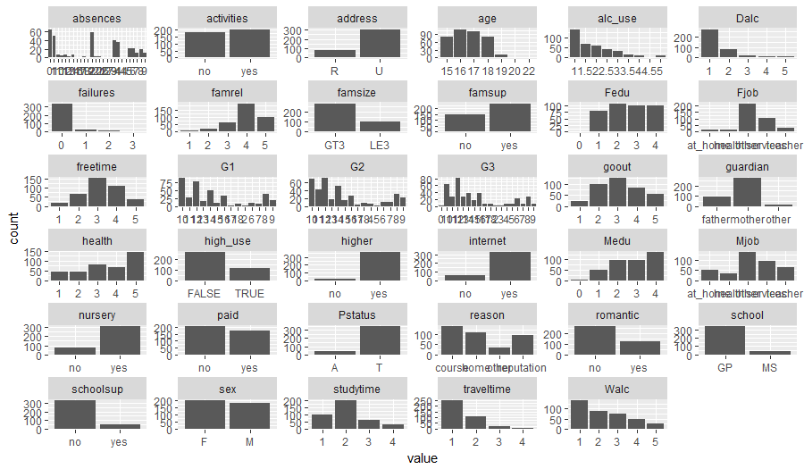

##### More info about the variables is in <https://archive.ics.uci.edu/ml/datasets/STUDENT+ALCOHOL+CONSUMPTION>

#### Four variables and the hypothesis of their relatioship with alcohol consumption

##### Variables:

1. Family relationships (famrel, 1-5)
  - Better family relationships decrease alcohol consumption
  
2. Sex, (sex, F/M)
  - Males drink more tha females
  
3. Address (address, urban/rural)
  - Urban living decreases alcohol consumption
  
4. Going out (goout, 1-5)
  - Going out increases alcohol consumption
  

#### Exploration of the variables relationship with high use of alcohol

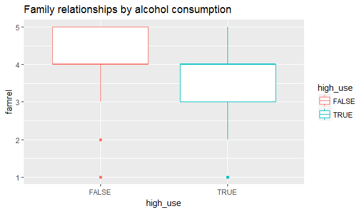

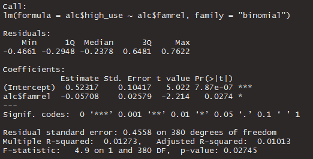

##### Good family relationships correlate negatively with the high use of alcohol. 

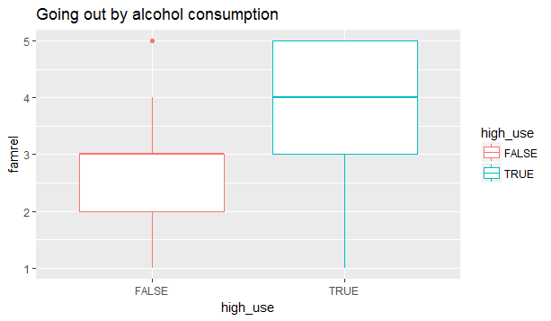
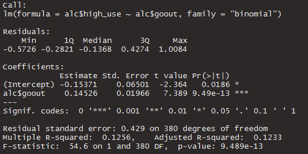
##### Going out correlates with the high consumption of alcohol.

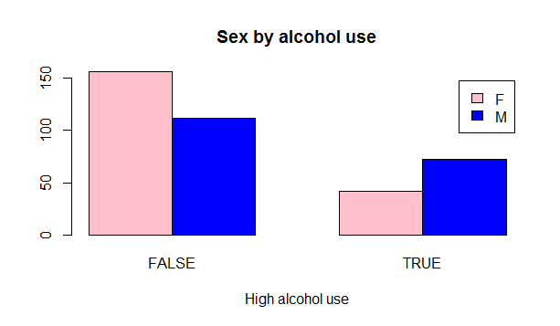
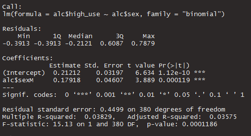
#####There is 198 females and 184 males in the data.  There is more men in high use of alcohol group than women. Also bigger portion of men was consuming alcohol than women. 

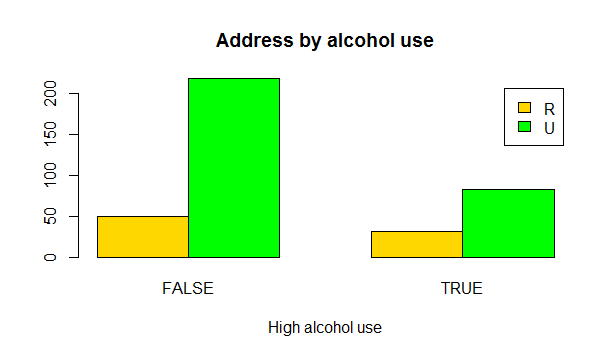

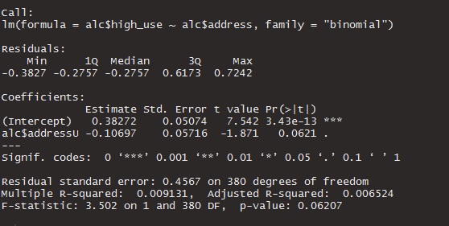
##### Urban living seems to correlate negatively with the high use of alcohol. 

### Summary of the fitted model shows that the variables do affect persons use of alcohol. P values suggest that all variables are statistically significant and errors aren't too bad.

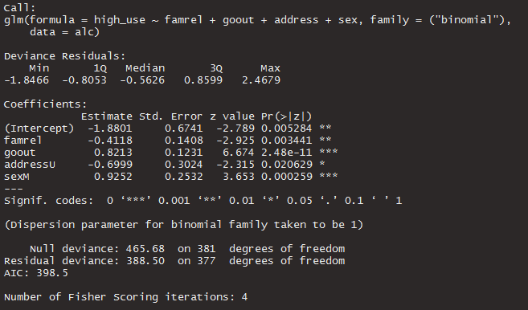

### Coefficients of the model as odds ratios and their confidence intervals shows that familyrelationships and urban address make it less likely to individual to have high alcohol consumption. Going out a lot and being a male makes it more likely to individual to consume a lot of alcohol.
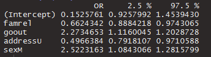

      
### Inaccutarely classified individuals. 
Predictions classifie 12 people falsely to high consume alcohol and 70 people falsely to not high use of alcohol.

| H/P    | FALSE  | TRUE  |       
| ------ | ------ | ----- |
| FALSE  | 256    |    12 |       
| TRUE   | 70     |    44 | 

### Training error is 0.2156597 ~ 22 %, so the model works better than just guessing.