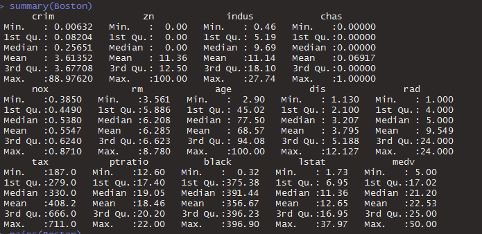
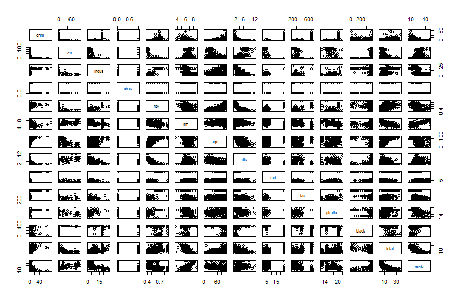
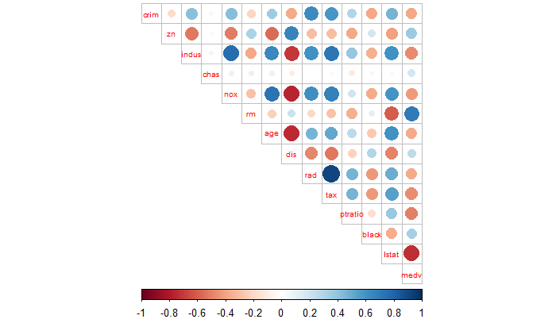
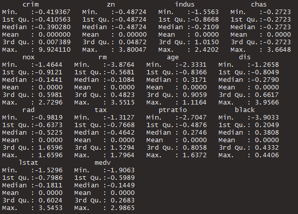
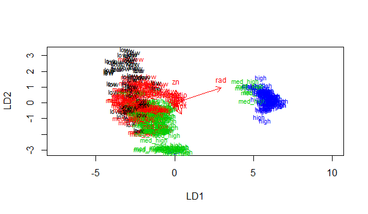
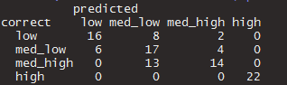
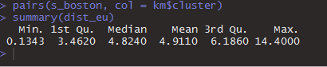
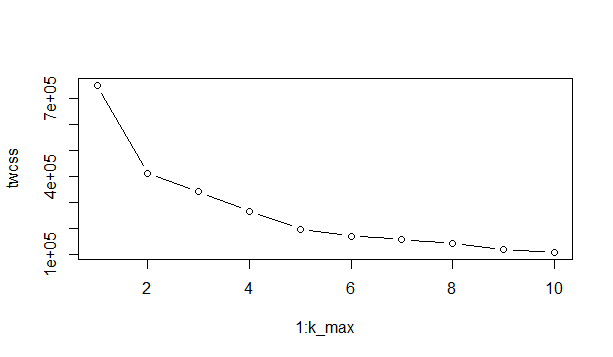
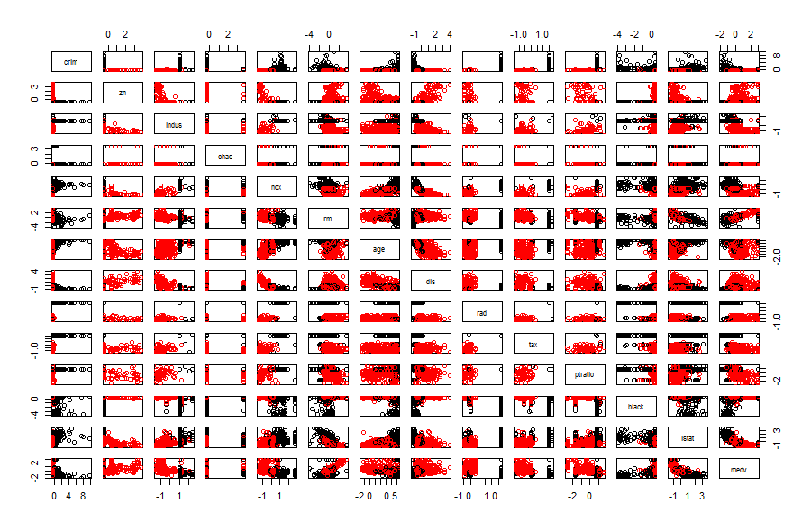

#Clustering and classification
#
#
#
##### Explanations for the variables can be found at: <https://stat.ethz.ch/R-manual/R-devel/library/MASS/html/Boston.html>

##### The data has 506 rows and 14 columns. Numerical summary of the variables looks like this:

##### The graphical summary of the variables. The variables aren't normally distributed. 

##### The graphical summary of the correlations of the variables.

##### Strongest positive correlations are between:
1.dis and 
  -age
  -nox 
  -indus
2. istat and medv

##### Strongest negative correlations are between:
1.tax and rad
2.indus and nox
#
#
#
##### Scaled variables. All the variables mean has been fitted at zero.

#####LDA plot

#####Cross tabulations

##### From the cross tabulations can be concluded that model does work to some exctenct. It works better on high and low values than the middle ones.

#### Summary of the distances between the observations. The eucliadian method was used.

#### Graphical look at the optimal number of clusters

##### Total wcss drops most rapidly from 1 to 2 so we choose 2 clusters for our model.

##### Results show that there is some similarity in the data and you can make okay predictions with it.

