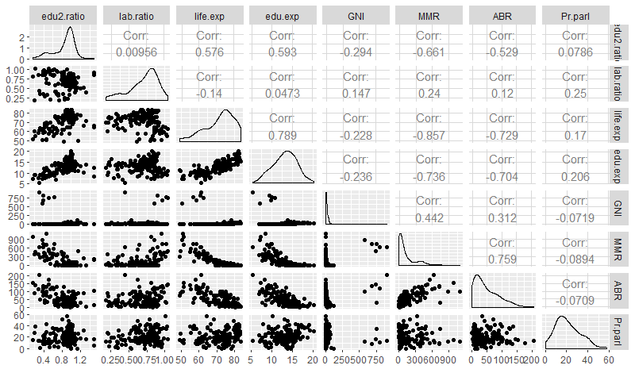
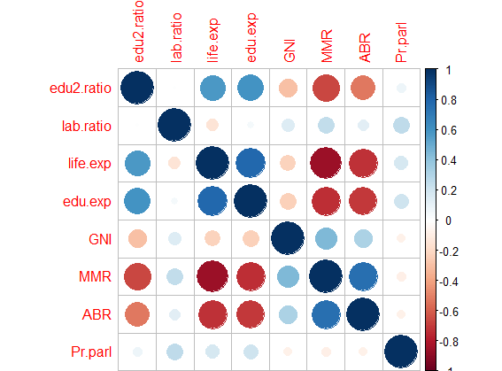
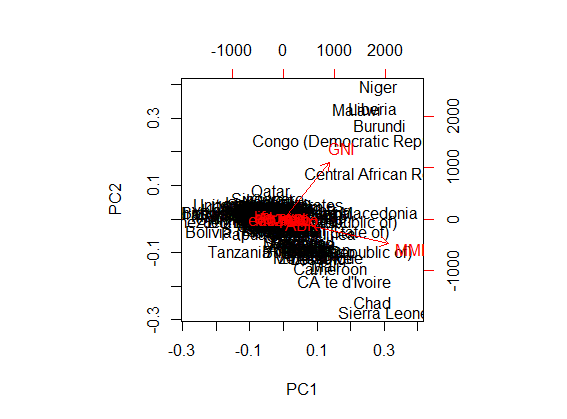
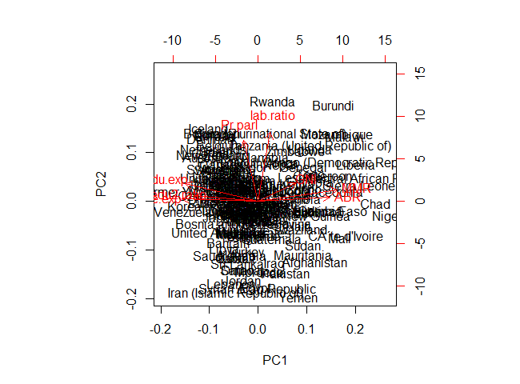
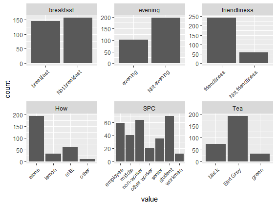
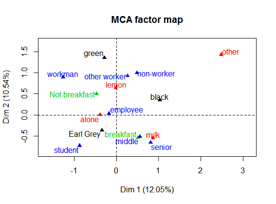

#Dimensionality reduction techniques

#### About the data
##### The data orgins from United Nations Development program. Variables relate to the measurmenting the well being development of the human in certain countries and areas.The data that is being used has 8 variables and 155 countries.

####Loading the data and exploring its variables

    human <- read.csv("human2", header = T, sep = ",", row.names =1)
    colnames(human)
    dim(human)
    summary(human)
 
#### Variables being looked into:
  1. Secondary education ratio female/male *edu2.ratio*
  2. Labor force ratio female/male *lab.ratio*
  3. Life expectancy at birth *life.exp*
  4. Excpected years of education *edu.exp*
  5. Gross National Income per capita *GNI*
  6. Maternal mortality ratio *MMR*
  7. Adolescent birth rate *ABR*
  8. Precent of females in parliment *PR.parl*
  
#### Visual reprensation
    library(GGally)
    library(dplyr)
    library(corrplot)
    
    ggpairs(human)
    
    cor(human)%>%corrplot()

#### Distributions of the variables

##### Gross National Income per capita (GNI) and Maternal Mortality Ratio (MMR) are leaning strongly towards the smaller values. Adolescent birt rate (ABR) is also quite small in most of the countries. Other variables are more evenly distributed with a peak in the middle values. 

#### Relationships between the variables
##### There is strong negative correlation between life expectancy (life.exp) and MMR.Life.exp correlates also negatively between ABR. Life.exp and edu.exp correlate positevly with each other. Edu.exp correlates negatively with MMR and ABR also.  

###PCA on non-standardized data
    summary(human)
    pca_human <- prcomp(human)
    biplot(pca_human, choices = 1:2)

  

### PCA on standardized data
     s_human <- scale(human)
     summary(s_human)
     spca_human <- prcomp(s_human)
     biplot(spca_human, choices = 1:2)

####Analysis of the PCA

#####The results differ a lot between standardized and non-standardized data. Frist one doesn't really tell anything, because most variables don't draw an arrow. 
  On the second one we can see that MMR and ABR correlate positevly with each other and negatively with life excpectancy and education excpectancy.Young mothers are more likely to die during pregnancy and child birth than older mothers. Also, young women are more likely to become pregnant in the countries that have lower education and life expectancy because of lack of possibilities to choose otherwise and little to none sexual education.
  
#####The two principal dimensions are secondary education ratio and labor force ratio. They have almost 0 correlation (0.00956).

### The tea dataset and Multiple Correspondence Analysis
    
    #libraries and data
    
    library(FactoMineR)
    library(ggplot2)
    library(dplyr)
    library(tidyr)
    library(leaps)
    library(scatterplot3d)adolesent child.
    data(tea)
    
    #Structure and dimensions
    str(tea)
    dim(tea)
    summary(tea)
###Structure of the data is a data frame with 300 observations and 36 factor variables.

####Six variables to look closer at

    # column names to keep in the dataset
    keep_columns <- c("Tea", "How", "breakfast", "SPC")
    
    # select the 'keep_columns' to create a new dataset
    tea_time <- select(tea, one_of(keep_columns))
    
    # look at the summaries and structure of the data
    summary(tea_time)
    str(tea_time)
    
    # visualize the dataset
    gather(tea_time) %>% ggplot(aes(value)) + facet_wrap("key", scales = "free") + geom_bar()+theme(axis.text.x = element_text(angle = 45, hjust = 1, size = 8))

    # multiple correspondence analysis
    mca <- FactoMineR::MCA(tea_time, graph = FALSE)
    
    # summary of the model
    summary(mca)
    
    # visualize MCA
    plot(mca, habillage = "quali", invisible=c("ind"))

####We can see breakfast, milk, middle and senior level workers are similar variables. 

